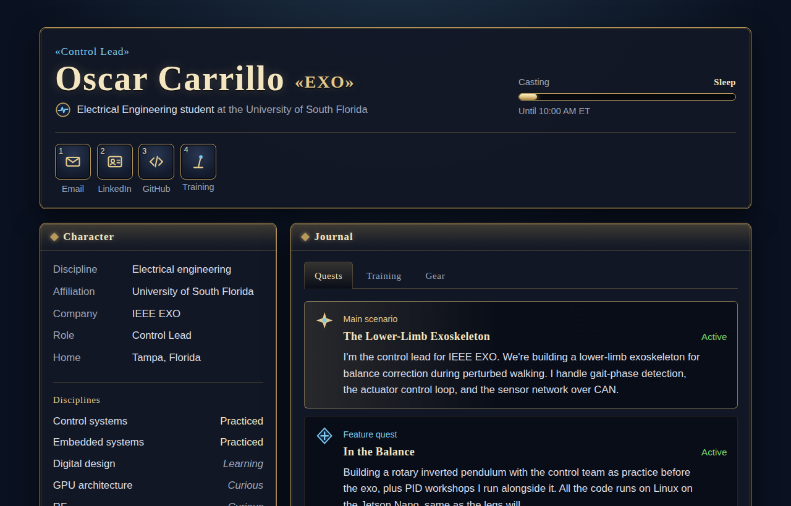

# oscarc727.github.io

My personal website, live at **[oscarc727.github.io](https://oscarc727.github.io)**.

It's styled like an MMO character sheet: projects are a quest journal, tools are a gear screen, and the Training tab has a 3D simulation of the rotary inverted pendulum my team is building, balanced by a PID controller you can tune yourself.

## What's on it

- **Quests:** my projects, each linking to its repo
- **Training:** a 3D Furuta pendulum sim with Kp, Ki, and Kd sliders and a few objectives to try
- **Gear:** the hardware, languages, and tools I use
- **Orchestrion:** what I'm listening to on Spotify, from my [widget fork](https://github.com/OscarC727/novatorem)

## How it's built

One `index.html` with no frameworks or build step. The 3D pendulum is a small hand-written renderer on a canvas, and GitHub Pages serves it straight from this repo.
